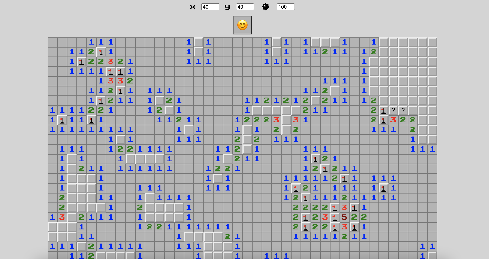
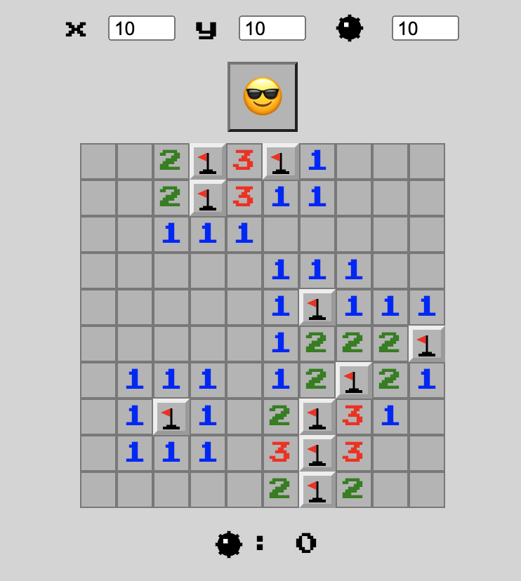
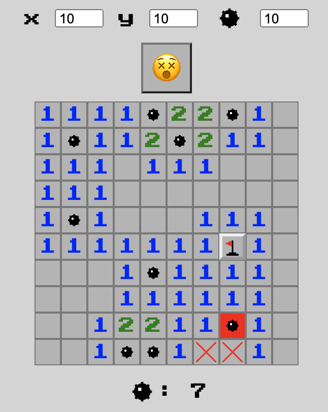

# Minesweeper
Modeled after the original Minesweeper game



## Features
- Board size adjustable (any rectangle or square sized 3x3 to 50x50), as well as number of bombs (3 to 2500)
- New Game button (emoji)
- Click: toggle square (and all empty ajacent squares) / activate bomb
- Right-click: 1x = place flag, 2x = place question mark, 3x = removes question mark

## Win


## Game Over


## Technologies
- React & ReactDOM
- Redux
- Testing-Library

## Requirements
- Node 6.13.0

## Installation (from within the Minesweeper directory)
### Install dependencies
```sh
npm install
```
### Create bundle file
```sh
npm run build (development mode)
```
### Start the server
```sh
npm start
```
### Run tests (oprional)
```sh
npm test
```